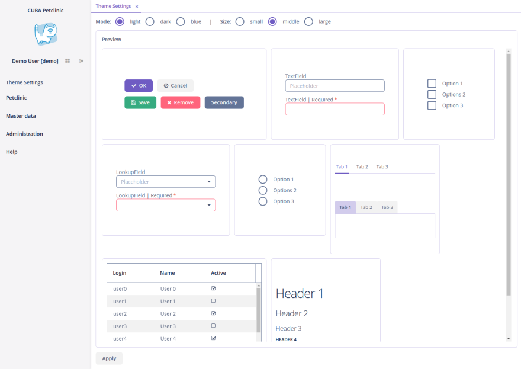

# Helium Theme



## Overview

Designed from scratch, Helium theme provides modern look and feel and customization capabilities.

Main features:

* CSS variables are used for colors. As a result it's possible to apply different color presets on the fly, 
without theme recompilation and app restart.
* Built-in size presets (small/large/medium), also switchable in runtime.
* Settings screen.

## Installation

[Install](https://doc.cuba-platform.com/studio/) add-on from marketplace or by the following coordinates, using CUBA Studio:

`com.haulmont.addon.helium:helium-global:<version>`

Pick a version which is compatible with the platform version used in your project:

| Platform Version | Add-on Version |
| ---------------- | -------------- |
| 7.2.4+           | 1.2.x          |
| 7.1.5+           | 1.1.x          |

## Theme Editor

[Theme editor](https://demo10.cuba-platform.com/helium-editor/) allows you to easily create custom color presets.

### Applying Custom Color Preset

To add a color preset you will need to extend Helium theme. See the [demo project](https://github.com/cuba-labs/helium-extension-demo)
and this particular commits:
 * [Extend Helium](https://github.com/cuba-labs/helium-extension-demo/commit/85ae53f7d07acaa31d1c737803ae2779b54f6ed7)
 * [Add helium-theme.properties](https://github.com/cuba-labs/helium-extension-demo/commit/2b7f72ebb0c6a25bee790e421302a31cca602347)

Place generated CSS variables in `helium-ext.scss` file, e.g.:

```scss
@mixin com_company_demo-helium-ext {
  /* Basic */
  --primary-color: #0097D8;
  --primary-color_rgb: 0, 151, 216;

  /* Common */
  --primary-color-shade-1: #0084BD;
  --primary-color-shade-2: #0076A8;
  --primary-dim-color: #2EC0FF;

  .dark {
    /* Common */
    --primary-dim-color: #195b7c;
  }
}
``` 

Studio 13 supports only platform themes extension, once [this issue](https://youtrack.cuba-platform.com/issue/STUDIO-4474) is resolved (presumably in release 14)
it will be possible to extend Helium without any manual actions.